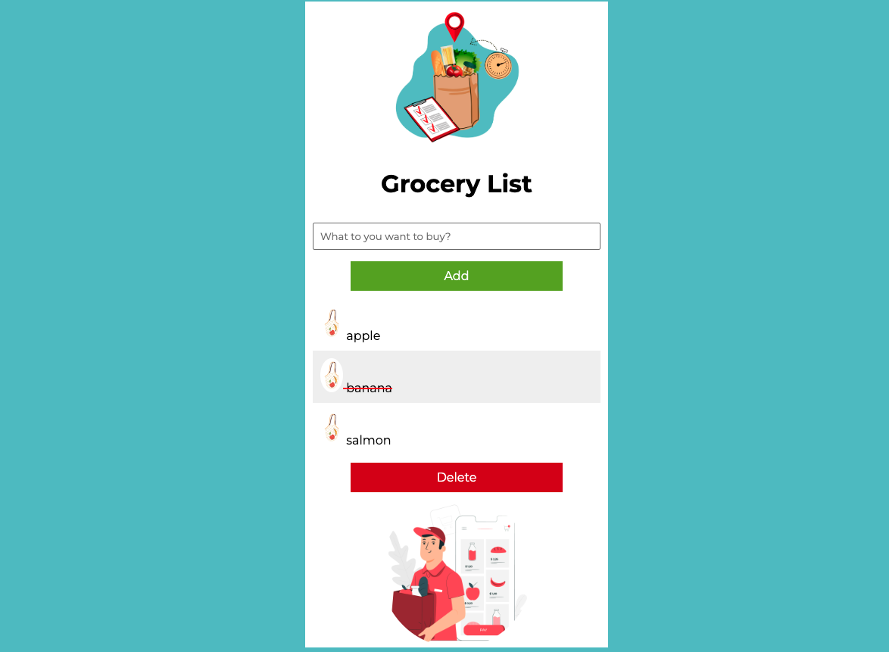

# 🛒 Grocery List App

## 📌 Project Overview
This project demonstrates core React fundamentals including state management, conditional rendering, and component-based architecture.  
The app focuses on simplicity, performance, and mobile-first usability.

---

## 🚀 Live Demo
[**View the Live Application here**](https://grocery-list-nataliia-litskevych.netlify.app/) 

## 📸 Preview

  

---

## ⚙️ Installation & Setup

1. Clone the repository:
   git clone https://github.com/NataliiaLitskevych/Grocery-list.git

2. Navigate to the project folder:
   cd grocery-list-app

3. Install dependencies:
   npm install

4. Start the development server:
   npm run dev

---

## 🧠 Technical Highlights
- Built with React functional components
- State management using useState hook
- Immutable state updates
- Conditional rendering for UI changes
- Clean component structure
 
 ---

 ## 🚧 Future Improvements
- Add categories (Vegetables, Dairy, etc.)
- Implement drag-and-drop reordering
- Add quantity support
- Add dark/light theme toggle
- Convert to full-stack version with backend

---

## 🧪 Testing
Run tests with:
npm run test

---

## 👩‍💻 Author

### © 2025 Nataliia Litskevych
